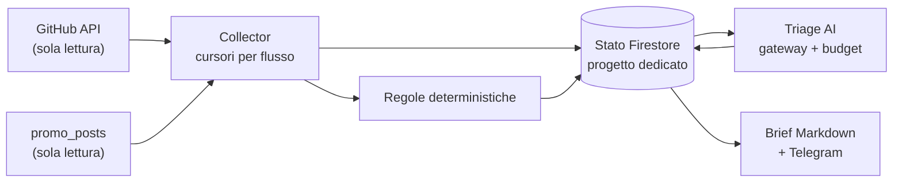

# GTP Orchestrator

Repository [michelecoppi/gtp_orchestrator](https://github.com/michelecoppi/gtp_orchestrator); il pacchetto Python si chiama
`supervisor` (`python -m supervisor ...`).

Supervisore di [Guess the Player from the Path](https://github.com/michelecoppi/guess_the_player_from_the_path) e
[Promo Studio](https://github.com/michelecoppi/promo_studio). Osserva sviluppo e promozione, registra fatti
verificabili, riconosce i problemi con regole deterministiche e manda a Michele un brief quotidiano.

Il riferimento è la specifica `GTP_Supervisor_Analisi_V1.md` (28/09/2026). Sono implementate le **tranche M0–M4**:
- sola lettura sui repository osservati;
- AI solo per il triage, entro un budget approvato e con prenotazione atomica (spenta finché Michele non la attiva);
- draft PR solo per le issue che Michele approva con l'etichetta `supervisor:fix`, senza merge automatici;
- nessuna azione senza approvazione.

## Che cosa fa oggi
- **Collector GitHub** per entrambi i repository:
  - branch di default e SHA di testa;
  - run di CI, deploy, backup e cron di Promo;
  - issue e PR;
  - stato della CI sullo SHA di testa di ogni PR aperta.
- **Collector Promo**: conteggi della coda `promo_posts`, bozze ferme, pubblicazioni fallite, approvati non
  pubblicati.
- **Regole**:
  - CI, deploy o workflow fallito sul branch di default;
  - PR senza CI verde;
  - branch di default inatteso;
  - problemi della coda Promo;
  - sorgente non disponibile.

  I finding si chiudono da soli quando la condizione sparisce.
- **Brief** deterministico: artifact di Actions e messaggio sul bot approvazioni di Promo (solo `sendMessage`).
- **Triage AI** (M2): per i finding nuovi un modello economico propone priorità, ruolo e prossimo passo. La
  proposta è validata da uno schema chiuso e non esegue nulla.
- **Gateway AI e budget**: policy, catalogo prezzi versionato, prenotazione atomica (1 USD/giorno, 15 USD/mese),
  nessun retry né fallback automatico, riconciliazione delle chiamate dall'esito incerto.
- **Worker engineering** (M3): per le issue approvate prepara una patch piccola. La verifica in Docker senza rete
  né segreti, la fa rivedere da un modello di un altro provider e un executor separato (l'unico con permessi di
  scrittura) apre una **draft PR** secondo le regole del gioco. Il supervisore segue poi la CI sullo SHA di
  testa. Nessun merge automatico.
- **Prodotto e growth** (M4): metriche PostHog in sola lettura con le definizioni del gioco (attivazione,
  completamento, ritorno, North Star, referral), sempre con denominatore e stato ("sotto soglia", "non
  disponibile"). Ogni settimana una proposta con fattibilità calcolata dal codice e una bozza di brief per
  Promo, fatta solo di fatti verificati.
- **Garanzie**:
  - deduplicazione degli eventi;
  - cursori che non si perdono dopo un crash;
  - lock con lease;
  - notifiche idempotenti;
  - "non disponibile" al posto di zero.

## Comandi
`python -m supervisor observe | report | status | doctor | replay | triage | budget | llm smoke | engineer ... | eval ... | growth ...` — vedi [docs/runbook.md](docs/runbook.md).

## Documenti
- [Audit M0 delle integrazioni](docs/audit/m0-integrations.md)
- [ADR 0001 — stato su Firestore](docs/adr/0001-stato-firestore.md)
- [ADR 0002 — bot condiviso](docs/adr/0002-bot-condiviso.md)
- [ADR 0003 — budget e gateway AI](docs/adr/0003-budget-e-gateway-ai.md)
- [ADR 0004 — worker engineering](docs/adr/0004-engineering-worker.md)
- [ADR 0005 — prodotto e growth](docs/adr/0005-product-growth.md)
- [Runbook](docs/runbook.md) · [Regole per gli agenti](AGENTS.md)

## Prossime tranche
| Fase | Contenuto |
|---|---|
| M5–M6 | Confronto provider, runbook operativo completo |

Licenza: PolyForm Noncommercial 1.0.0 (vedi [LICENSE](LICENSE)).
