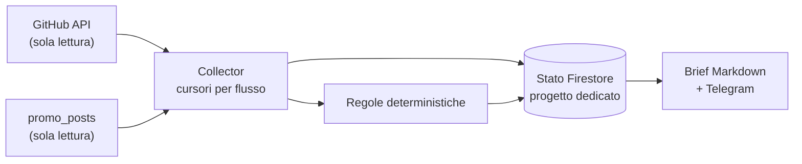

# GTP Supervisor

Supervisore di [Guess the Player from the Path](https://github.com/michelecoppi/guess_the_player_from_the_path) e
[Promo Studio](https://github.com/michelecoppi/promo_studio). Osserva sviluppo e promozione, registra fatti
verificabili, riconosce i problemi con regole deterministiche e manda a Michele un brief quotidiano.

Il riferimento è la specifica `GTP_Supervisor_Analisi_V1.md` (28/09/2026). Questa è la **tranche M0 + M1**:
- sola lettura sui repository osservati;
- nessuna chiamata AI;
- nessuna azione senza approvazione.

## Che cosa fa oggi
- **Collector GitHub** per entrambi i repository:
  - branch di default e SHA di testa;
  - run di CI, deploy, backup e cron di Promo;
  - issue e PR;
  - stato della CI sullo SHA di testa di ogni PR aperta.
- **Collector Promo**: conteggi della coda `promo_posts`, bozze ferme, pubblicazioni fallite, approvati non
  pubblicati.
- **Regole**:
  - CI, deploy o workflow fallito sul branch di default;
  - PR senza CI verde;
  - branch di default inatteso;
  - problemi della coda Promo;
  - sorgente non disponibile.

  I finding si chiudono da soli quando la condizione sparisce.
- **Brief** deterministico: artifact di Actions e messaggio sul bot approvazioni di Promo (solo `sendMessage`).
- **Garanzie**:
  - deduplicazione degli eventi;
  - cursori che non si perdono dopo un crash;
  - lock con lease;
  - notifiche idempotenti;
  - "non disponibile" al posto di zero.

## Comandi
`python -m supervisor observe | report | status | doctor | replay` — vedi [docs/runbook.md](docs/runbook.md).

## Documenti
- [Audit M0 delle integrazioni](docs/audit/m0-integrations.md)
- [ADR 0001 — stato su Firestore](docs/adr/0001-stato-firestore.md)
- [ADR 0002 — bot condiviso](docs/adr/0002-bot-condiviso.md)
- [Runbook](docs/runbook.md) · [Regole per gli agenti](AGENTS.md)

## Prossime tranche
| Fase | Contenuto |
|---|---|
| M2 | `LLMClient` (LiteLLM), catalogo prezzi versionato, prenotazione atomica del budget (15 USD/mese), triage in dry-run |
| M3 | Worker engineering isolato, executor separato, draft PR nel rispetto di `AGENTS.md` del gioco |
| M4 | `campaign_id`/`brief_id`, funnel PostHog, brief strutturati verso Promo |
| M5–M6 | Confronto provider, runbook operativo completo |

Licenza: PolyForm Noncommercial 1.0.0 (vedi [LICENSE](LICENSE)).
